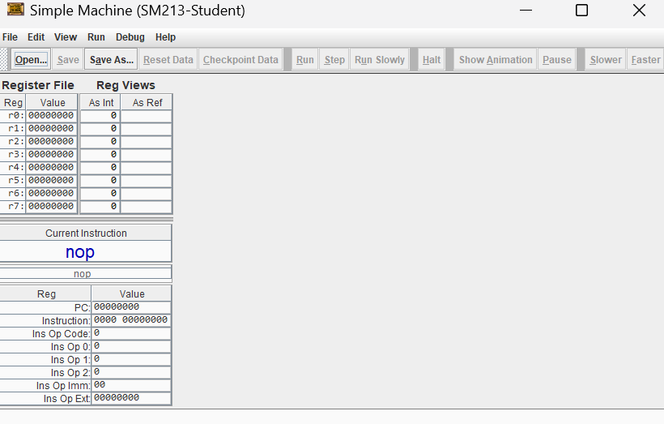
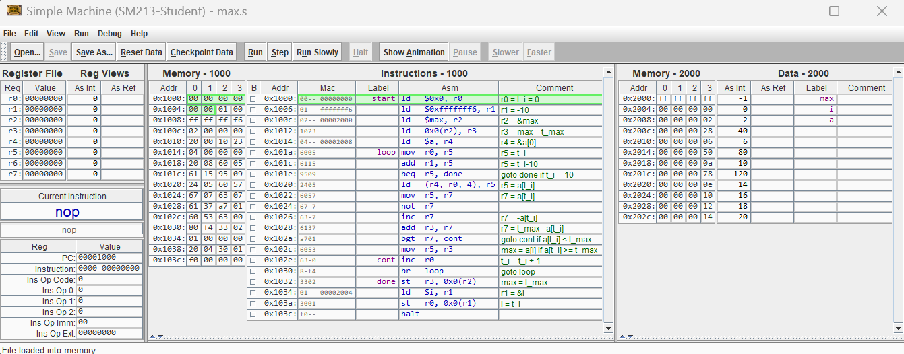
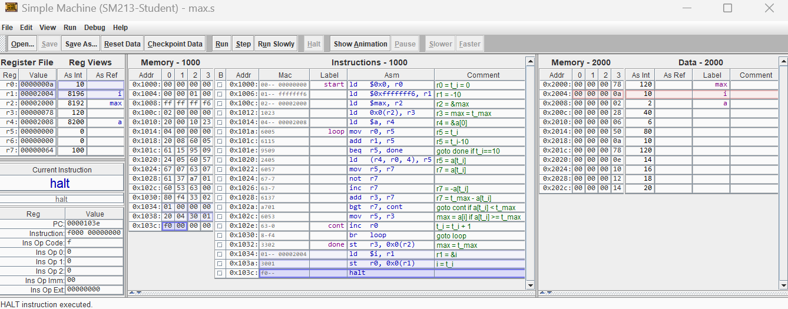

# CPU Simulator Project

## Table of Contents
1. [Overview](#overview)
2. [Core Concepts](#core-concepts)
3. [Languages, Libraries, and Dependencies](#languages-libraries-and-dependencies)
4. [Demo](#demo)

## Overview
This project is the course project I completed in my Computer Systems class at UBC (CPSC 213). In this project, I have implemented the fetch-execute cycle for a custom CPU. Alongside the implementation, I am also able to step through any assembly file on the simulator and see how the values in memory and registers are changing as each assembly instruction is executed. The architecture for this CPU is a very simplified version of the x86 architecture designed by Intel. The CPU is a 32-bit system and has 8 registers total. The only type of data we will be working with are 32-bit integers.

## Core Concepts
- **Computer Architecture**: Understanding the structure and function of the CPU.
- **CPUs**: The design and function of the central processing unit.
- **Assembly**: Programming using low-level instructions specific to the CPU architecture.
- **Machine Code**: Binary code that the CPU executes directly.
- **Memory Layout and Management**: How data is stored and accessed in memory.
- **Hardware Simulation and Testing**: Simulating the hardware to test CPU functionality.

## Languages, Libraries, and Dependencies
- **Java**: The primary language used to implement the simulator.
- **Custom Assembly**: A custom assembly language designed for the simulator.
- **JUnit Testing Suite**: Used for testing the simulator.

## Demo
### The CPU Simulator with no program loaded in:

### The CPU Simulator once we load in an assembly program:

*Note: This particular assembly program finds the maximum value of a statically allocated array named `a` and stores it into a global variable called `max`.*

### The CPU Simulator at the end of the simulation:

As we can see on the right-hand side, the global variable `max` stores the value 120, which is precisely the maximum value in the array `a`. Similarly, the counter variable `i` holds the value 10, which is precisely the size of the array.
